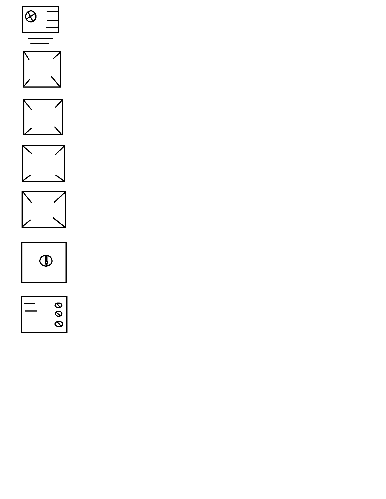
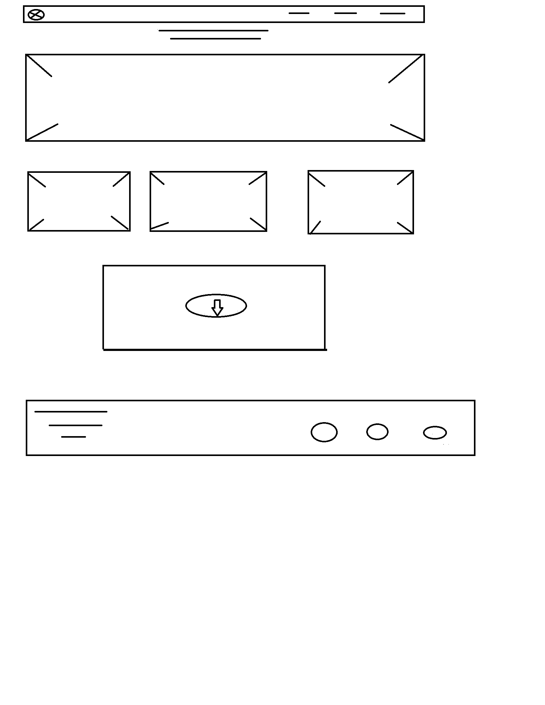

  # REQUISITOS QUENERALES:

	## Una página web de escuela de música que  contiene:
	## una barra de navegacion con un logo de la escuela y 5 link que rédireccione en inicio,nosotros, profesores, agrupaciones y contacto. 

	 La página contine 7 secciones

	### La primera, es el nav barra de navegación, que incluye el titulo principal y un carrusel.

	### La segunda sección es Nosotros, tiene una imagen, con un párrafo que señala la historia de la escuela.
	
	### La tercera sección es Profesores e Instrumentos contiene una imagen y los nombres de profesores y talleres

	### La cuarta sección contiene una imagen de la escuela y un párrafo donde indica las agrupaciones de esta.

	#### La quinta sección es un video de ensayo de concierto.

	### La sexta sección contiene un formulario de contacto y un mapa de la direccion de esta ecuela.

	### La séptima sección es el footer contiene un título, teléfono, dirección y página de la escuela 

		# REQUERIMIENTOS ESPECÍFICOS
	 

	## Usar repositório Font awesome
	## javascript
	## jquery
	## Videos conciertos, o consultar en la Escuela si cuentan con algunos de estos subidos a youtube o facebook
	## Usar bootstrap
	## Usar google fonts
	## Usar google pattern de ser necesario algún fondo para páginas
	## Investigar sobre la escuela de música en Centro Cultural de Quilicura
	## Ir al municipio para sacar mayor información 

	# REQUERIMIENTOS VISUALES:

	## Para crear layout usar booststrap
	## Fuentes: buscar en Google Fonts
	         ### títulos
		     ### párrafos

	    ## Colores
		## Letras #323333
		## Botones íconos: #121619
		## Íconos: para buscar estos usaré font-awesome
		## Imágenes, estas serán sacadas con disposito movil o facilitadas por la Escuela de Música y algunas de estás pueden ser sacadas de Google
		

		sketch

		
		
		

 https://nydiacaro.github.io/directorios/.